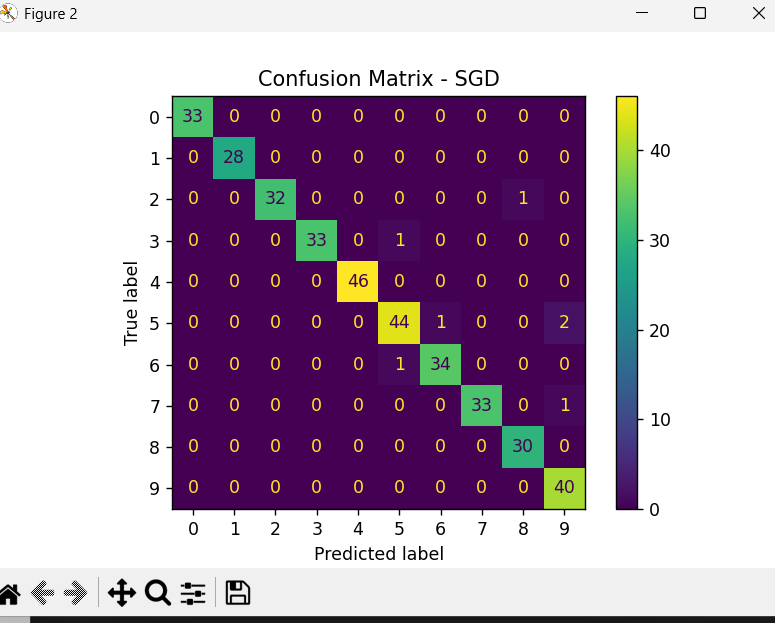

# MLP-Digits-Classification-SGD-vs-Adam
# 🧠 MLP Digits Classification (SGD vs Adam)

## 📌 Overview

This project implements a **Multilayer Perceptron (MLP)** model on the digits dataset from `sklearn`.

It compares two optimizers:

* **SGD (Stochastic Gradient Descent)**
* **Adam (Adaptive Moment Estimation)**

---

## 📊 Dataset

* Source: `sklearn.datasets.load_digits`
* Samples: **1797**
* Features: **64 (8x8 pixel images)**
* Classes: **10 (digits 0–9)**

---

## ⚙️ Model Details

* Hidden Layer: 64 neurons
* Activation: ReLU
* Iterations: 200

---

## 📈 Results

### 🔹 Loss vs Iteration


### 🔹 Confusion Matrix (SGD)



### 🔹 Confusion Matrix (Adam)


---

## 🏆 Performance Comparison

| Optimizer | Accuracy |
| --------- | -------- |
| SGD       | XX%      |
| Adam      | XX%      |

👉 Adam typically performs better due to adaptive learning rates.

---

## 🚀 How to Run

```bash
pip install -r requirements.txt
python main.py
```

---

## 📚 Technologies Used

* Python
* NumPy
* Matplotlib
* Scikit-learn

---

## ✨ Author

**Nimra Jabbar**
